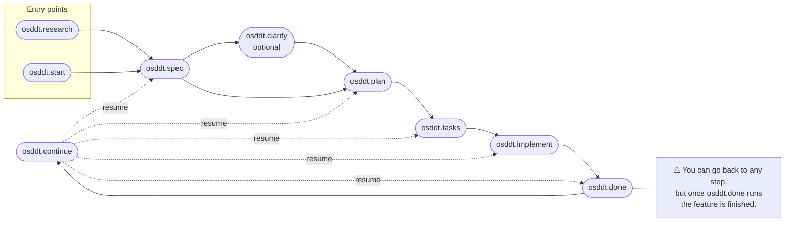

# osddt
Other spec driven development tool but for monorepo

## CLI Commands

| Command                                                              | Description                                                   |
| -------------------------------------------------------------------- | ------------------------------------------------------------- |
| `@dezkareid/osddt setup`                                             | Generate agent command files for Claude and Gemini            |
| `@dezkareid/osddt setup --agents <list> --repo-type <type>`          | Non-interactive setup (for CI/scripted environments)          |
| `@dezkareid/osddt meta-info`                                         | Output current branch and date as JSON                        |
| `@dezkareid/osddt done <feature-name> --dir <project-path>`          | Move `working-on/<feature>` to `done/<feature>`               |
| `@dezkareid/osddt update`                                            | Regenerate agent command files from the existing `.osddtrc`   |

### `osddt setup` options

| Flag | Values | Description |
| ---- | ------ | ----------- |
| `--agents <list>` | `claude`, `gemini` (comma-separated) | Skip the agents prompt and use the provided value(s) |
| `--repo-type <type>` | `single`, `monorepo` | Skip the repo type prompt and use the provided value |
| `-d, --dir <directory>` | any path | Target directory (defaults to current working directory) |

Both flags are optional. Providing neither runs the fully interactive mode. Providing both skips all prompts.

```bash
# Interactive (default)
npx @dezkareid/osddt setup

# Non-interactive (CI-friendly)
npx @dezkareid/osddt setup --agents claude,gemini --repo-type single
```

## Command Templates

Run `npx @dezkareid/osddt setup` once to generate the agent command files.

`osddt.research` and `osddt.start` are **peer entry points** — use whichever fits your situation. Both lead to `osddt.spec`. If you close the coding session, execute `osddt.continue` to resume the workflow.



### Example workflows

#### Starting with research

```
/osddt.research add payment gateway
/osddt.spec add-payment-gateway
/osddt.clarify add-payment-gateway   # optional — resolve open questions
/osddt.plan use Stripe SDK, REST endpoints, no webhooks
/osddt.tasks
/osddt.implement
/osddt.done
```

#### Starting directly

```
/osddt.start add user profile page
/osddt.spec add-user-profile-page
/osddt.plan React with React Query, REST API
/osddt.tasks
/osddt.implement
/osddt.done
```

#### Resuming after closing a session

```
# You closed your agent session and want to pick up where you left off:
/osddt.continue add-payment-gateway
# → detects osddt.plan.md exists and reports:
#   "Planning phase complete. Run: /osddt.tasks"
/osddt.tasks
/osddt.implement
/osddt.done
```

| Template           | Description                                                        |
| ------------------ | ------------------------------------------------------------------ |
| `osddt.continue`   | Detect the current workflow phase and prompt the next command      |
| `osddt.research`   | Research a topic and write a research file to inform the spec      |
| `osddt.start`      | Start a new feature by creating a branch and working-on folder     |
| `osddt.spec`       | Analyze requirements and write a feature specification             |
| `osddt.clarify`    | Resolve open questions in the spec and record decisions (optional) |
| `osddt.plan`       | Create a technical implementation plan from a specification        |
| `osddt.tasks`      | Generate actionable tasks from an implementation plan              |
| `osddt.implement`  | Execute tasks from the task list one by one                        |
| `osddt.done`       | Resolve project path, verify tasks, and move the feature to done   |

Generated files are placed in:

- `.claude/commands/osddt.<name>.md` (Claude Code)
- `.gemini/commands/osddt.<name>.toml` (Gemini CLI)

## Development

### Running Tests

```bash
# Run the full test suite once
pnpm test

# Run in watch mode during development
pnpm run test:watch
```

### Local Setup

After making changes to the source, rebuild and regenerate the agent command files in the repository:

```bash
pnpm run setup-local
```

This runs `pnpm run build` followed by `npx osddt setup`, prompting you to select which agents to configure and the repo type.
