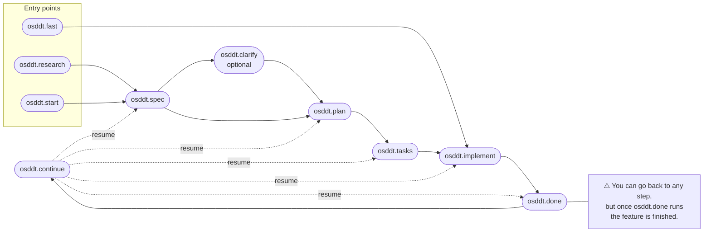

# osddt
Other spec driven development tool but for monorepo

## CLI Commands

| Command                                                                          | Description                                                   |
| -------------------------------------------------------------------------------- | ------------------------------------------------------------- |
| `@dezkareid/osddt setup`                                                         | Generate agent command files for Claude and Gemini            |
| `@dezkareid/osddt setup --agents <list> --repo-type <type>`                      | Non-interactive setup (for CI/scripted environments)          |
| `@dezkareid/osddt setup --worktree-repository <url>`                             | Setup with worktree workflow enabled                          |
| `@dezkareid/osddt meta-info`                                                     | Output current branch and date as JSON                        |
| `@dezkareid/osddt done <feature-name> --dir <project-path>`                      | Move `working-on/<feature>` to `done/<feature>`               |
| `@dezkareid/osddt done <feature-name> --dir <project-path> --worktree`           | Archive feature, remove git worktree, and clean state file    |
| `@dezkareid/osddt update`                                                        | Regenerate agent command files from the existing `.osddtrc`   |
| `@dezkareid/osddt start-worktree <feature-name>`                                 | Create a git worktree for a feature and scaffold working-on/  |
| `@dezkareid/osddt start-worktree <feature-name> --dir <package-path>`            | Same, specifying the package path in a monorepo               |
| `@dezkareid/osddt worktree-info <feature-name>`                                  | Look up worktree paths for a feature (JSON output)            |

### `osddt setup` options

| Flag | Values | Description |
| ---- | ------ | ----------- |
| `--agents <list>` | `claude`, `gemini` (comma-separated) | Skip the agents prompt and use the provided value(s) |
| `--repo-type <type>` | `single`, `monorepo` | Skip the repo type prompt and use the provided value |
| `--worktree-repository <url>` | any git URL | Enable worktree workflow and save the repository URL |
| `-d, --dir <directory>` | any path | Target directory (defaults to current working directory) |

All flags are optional. Providing neither runs the fully interactive mode. Providing `--agents` and `--repo-type` together skips all standard prompts. Adding `--worktree-repository` also runs environment checks and initialises the worktree state file.

The selected agents and config are saved in `.osddtrc` so that `osddt update` can regenerate the correct files without prompting.

```json
// Standard mode
{ "repoType": "single", "agents": ["claude"] }

// Worktree mode — the "worktree-repository" field enables the worktree workflow
{ "repoType": "single", "agents": ["claude"], "worktree-repository": "https://github.com/org/repo.git" }
```

```bash
# Interactive (default)
npx @dezkareid/osddt setup

# Non-interactive (CI-friendly)
npx @dezkareid/osddt setup --agents claude,gemini --repo-type single
```

## Command Templates

Run `npx @dezkareid/osddt setup` once to generate the agent command files.

`osddt.research` and `osddt.start` are **peer entry points** — use whichever fits your situation. Both lead to `osddt.spec`. If you close the coding session, execute `osddt.continue` to resume the workflow.


```mermaid
flowchart LR
    continue([osddt.continue])

    subgraph entry[Entry points]
        research([osddt.research])
        start([osddt.start])
        fast([osddt.fast])
    end

    spec([osddt.spec])
    clarify([osddt.clarify\noptional])
    plan([osddt.plan])
    tasks([osddt.tasks])
    implement([osddt.implement])
    done([osddt.done])

    research --> spec
    start --> spec
    fast --> implement
    spec --> clarify
    clarify --> plan
    spec --> plan
    plan --> tasks
    tasks --> implement
    implement --> done
    done --> continue
    continue -.resume.-> spec & plan & tasks & implement & done

    note["⚠️ You can go back to any step,\nbut once osddt.done runs\nthe feature is finished."]
    done --- note
```

### Example workflows

#### Starting with research

```
/osddt.research add payment gateway
/osddt.spec add-payment-gateway
/osddt.clarify add-payment-gateway   # optional — resolve open questions
/osddt.plan use Stripe SDK, REST endpoints, no webhooks
/osddt.tasks
/osddt.implement
/osddt.done
```

#### Starting directly

```
/osddt.start add user profile page
/osddt.spec add-user-profile-page
/osddt.plan React with React Query, REST API
/osddt.tasks
/osddt.implement
/osddt.done
```

#### Fast mode (spec + plan + tasks in one shot)

```
/osddt.fast add payment gateway
# → creates branch, writes spec, plan (with Assumptions), and task list automatically
/osddt.implement
/osddt.done
```

> Review the `## Assumptions` section of `osddt.plan.md` before implementing. Run `/osddt.clarify` if any Open Questions in the spec need resolving first.

#### Parallel feature workflow (git worktree)

Enable worktree mode by providing the repository URL during setup:

```bash
npx @dezkareid/osddt setup --agents claude --repo-type single --worktree-repository https://github.com/org/repo.git
```

This saves `"worktree-repository"` in `.osddtrc`, runs environment checks, and initialises the `.osddt-worktrees` state file. From that point on, `/osddt.start` automatically uses the worktree workflow:

```
/osddt.start add-payment-gateway
/osddt.spec
/osddt.plan use Stripe SDK, REST endpoints
/osddt.tasks
/osddt.implement
/osddt.done
```

The worktree is created as a sibling of your repo (e.g. `../my-repo-add-payment-gateway`). The `working-on/` planning folder lives inside the worktree alongside the code. When `osddt.done` runs, it archives the planning folder **and** removes the worktree automatically.

You can customise the worktree base directory by adding `worktreeBase` to `.osddtrc`:

```json
{
  "repoType": "single",
  "worktree-repository": "https://github.com/org/repo.git",
  "worktreeBase": "/Users/me/worktrees"
}
```

Active worktrees are tracked in `.osddt-worktrees` (sibling to the repo root), a JSON array with entries containing `featureName`, `branch`, `worktreePath`, `workingDir`, and `repoRoot`. This file is the single source of truth used by `osddt.continue` and `osddt.done` to resolve the correct paths.

> **Migration note**: If you previously used `osddt setup-worktree` or `/osddt.start-worktree`, those commands have been removed. Re-run `osddt setup --worktree-repository <url>` to configure the new unified workflow. Manually delete any `osddt.start-worktree.*` files from your agent command directories — `osddt update` will not regenerate them.

#### Resuming after closing a session

```
# You closed your agent session and want to pick up where you left off:
/osddt.continue add-payment-gateway
# → detects osddt.plan.md exists and reports:
#   "Planning phase complete. Run: /osddt.tasks"
/osddt.tasks
/osddt.implement
/osddt.done
```

| Template         | Description                                                        |
| ---------------- | ------------------------------------------------------------------ |
| `osddt.continue` | Detect the current workflow phase and prompt the next command      |
| `osddt.research` | Research a topic and write a research file to inform the spec      |
| `osddt.start`    | Start a new feature — uses standard or worktree workflow based on `.osddtrc` |
| `osddt.spec`     | Analyze requirements and write a feature specification             |
| `osddt.clarify`  | Resolve open questions in the spec and record decisions (optional) |
| `osddt.plan`     | Create a technical implementation plan from a specification        |
| `osddt.tasks`    | Generate actionable tasks from an implementation plan              |
| `osddt.implement`| Execute tasks from the task list one by one                        |
| `osddt.fast`     | Bootstrap all planning artifacts (spec, plan, tasks) in one shot   |
| `osddt.done`     | Resolve project path, verify tasks, and move the feature to done   |

Generated files are placed in:

- `.claude/commands/osddt.<name>.md` (Claude Code)
- `.gemini/commands/osddt.<name>.toml` (Gemini CLI)

## Development

### Running Tests

```bash
# Run the full test suite once
pnpm test

# Run in watch mode during development
pnpm run test:watch
```

### Local Setup

After making changes to the source, rebuild and regenerate the agent command files in the repository:

```bash
pnpm run setup-local
```

This runs `pnpm run build` followed by `npx osddt setup`, prompting you to select which agents to configure and the repo type.
